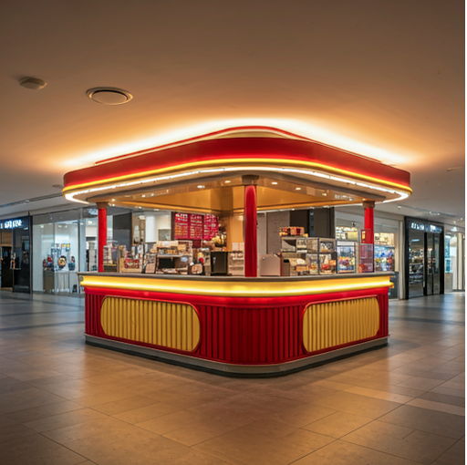

# Contêineres

Nesta analogia, não tratamos da programação em si, mas de uma infraestrutura possível para que a programação possa acontecer ou, uma infraestrutura para que nossas comidas possam ser preparadas e consumidas. Para tal, consideraremos o contexto de franquias de negócio no formato de ilhas de produtos alimentícios em shoppings. 

Uma ilha pode ser vista como um restaurante (cozinha mais área para se servir) compacto. Ser compacta permite que esta possa ser instalada, desinstalada e replicada com facilidade, diferente de um restaurante convencional. 

Toda franquia, quando é contratada, define direitos e deveres de franqueados e franqueadores. No contexto de contêineres, esses contratos são especificações de contêineres, as quais descrevem como estes se constituirão. Como se trata de infraestrutura para a execução de programas, estas especificações definem como se constituem as máquinas necessárias para rodar nossos programas, ou seja, preparar nossas receitas. 

E se sou um empreendedor em busca de oportunidades e gostaria de saber que franquias estão disponíveis hoje para serem contratadas? A Associação Brasileira de Franquias (ABF) possui . No contexto de contêineres, o análogo seria um site como o , o qual é um repositório de especificação de contêineres para diversos propósitos. 

Ao se contratar uma franquia, com o contrato assinado contendo a especificação da ilha, todo material necessário para a construção precisa ser comprado. Caso falte algum material, a ilha não conseguirá ser construída e, talvez, a especificação precise ser revista. Caso tudo esteja disponível, no contexto de contêineres, esse material pode ser visto como a imagem do contêiner. 

Com o material, podemos partir para a construção da ilha. Em contêineres, essa construção é o momento onde a imagem de um contêiner é instanciada, ou seja, uma máquina é criada. 

Após a construção da ilha, esta pode iniciar seu funcionamento de preparo e entrega de alimentos. Em contêineres, esse é o momento em que nossos programas executam na máquina que foi construída. 

A gerência de uma única ilha é uma tarefa simples. Entretanto, no cenário de empresários que precisam gerenciar simultaneamente várias ilhas com tipos de produtos diferentes, a tarefa pode ser um tanto desafiadora. Uma solução que pode amenizar a tarefa do empresário é contratar um gerente especializado em gerenciar ilhas de produção de alimentos. No contexto de contêineres, esse gerente é um orquestrador de contêineres, o qual permite o controle de diversos contêineres de uma forma mais amigável. Com este pode-se disparar ou interromper todos ou uma parte desses  contêineres, consultar seus status, criar relações de dependência, dentre outras possibilidades. Nas franquias, o gerente pode consultar a rentabilidade das ilhas, criar regras para indicar quando uma ilha específica precisa ser analisada ou até encerrada, é por aí vai. 

 

