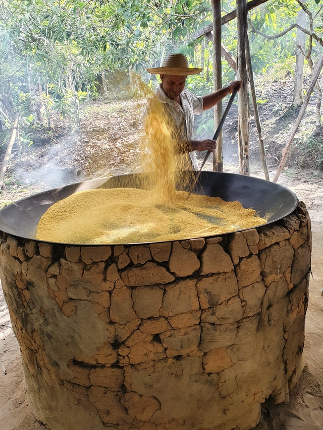

# Heurística

Heurísticas são técnicas de programação usadas para se resolver uma parte usualmente complexa de um problema específico. Estas técnicas normalmente são criadas a partir de muita experimentação na resolução destes cenários complexos. 

Na cozinha, considere o cozimento do aipim (mandioca, macaxeira) para usá-lo em algum preparo, como um escondidinho ou uma pizza com massa de aipim. Como o aipim é uma raiz firme, seu cozimento (fervura em água) leva tempo. Esse tempo precisa ser considerado no preparo de qualquer receita que o utilize. Quanto mais rápido o cozinhamos, mais rapidamente podemos utilizá-lo para continuar o restante da receita.

Na busca por esta rapidez, várias técnicas são utilizadas. A mais direta e eficiente é cozinhar o aipim numa panela de pressão. Entretanto, quando se quer pouca quantidade de aipim e a panela existente é muito grande, quando não se tem uma panela de pressão, ou por qualquer outro impedimento, a panela de pressão pode não ser uma opção. Daí, podemos utilizar uma panela comum com água. Com alguma experimentação e intuição, percebemos que cozinhar com a panela fechada acelera o processo, pois a temperatura dentro da panela ficará maior. Outra dica que já encontrei é não colocar sal no início do aquecimento da panela, pois o sal retarda a fervura da água. Cozinhar pedaços menores facilita a quebra das fibras que amolecem a raiz. Caso a raiz demore a amolecer, jogar água fria para reiniciar o cozimento (choque térmico) ajuda a amolecer o aipim. Para concluir as dicas, assim que o cozimento alcança os 100 graus, ou seja, quando a água começar a ferver, sua temperatura não eleva mais e fogo pode ser baixado. Do contrário, a água evaporaria muito rapidamente. Com isso, o cozimento continuará e economizará energia. 

Todas estas dicas, e outras que podem ser descobertas, podem ser encaradas como heurísticas voltadas para o cozimento mais rápido e eficiente de um aipim. Heurísticas em Computação não estão atreladas apenas a velocidade. Problemas de organização de espaço (como nas dispensas, bancadas e armários), melhor ordenação de tarefas (ordenação das etapas de preparo de uma receita), dentre outros, podem ser cruciais e determinar a viabilidade de um sistema. O mesmo vale na cozinha. Um restaurante, por exemplo, precisa realizar preparos prévios para oferecer um prato que leva 8h para ser preparado. Maniçoba, uma espécie de feijoada sem feijão, prato típico paraense feito da folha da mandioca, leva 7 dias para ser preparado.

Na Computação também encontramos o termo metaheurística, que se trata da ideia abstrata por trás da heurística. Nesta nossa analogia, una metaheurística seria a generalização das técnicas de aceleração de cozimento aplicadas a qualquer alimento, como batatas, cenouras e por aí vai. 

Para concluir, a imagem que utilizei é um forno para o preparo da farinha de mandioca. Estes são comumente encontrados nas casas de farinha existentes no interior das cidades, sendo mais frequentes nos estados do nordeste. 
