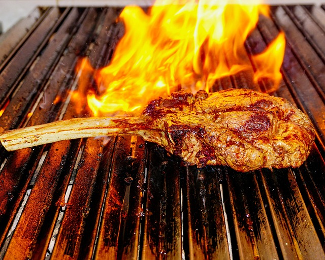

# IA's Generativas

IA's Generativas são programas que funcionam como oráculos, recebendo uma **pergunta** como entrada (*prompt*) e retornando a **resposta** a esta pergunta. A popularização dessas ferramentas se deu por diversas razões, como sua abrangência de conteúdos, qualidade das respostas, velocidade de processamento, possibilidade de entradas e respostas que não sejam apenas texto (imagem, documentos pdfs, ...), e por aí vai.

De forma simplificada, estas ferramentas utilizaram conteúdo disponível na internet como base de conhecimento e a construção de uma resposta é feita de forma estatística, analisando, para cada palavra, o que ocorre em seguida a esta com mais frequência.

Na cozinha, o preparo de uma receita por robôs já não é uma grande novidade em alguns lugares do mundo. Entretanto, a elaboração da receita já se torna um pouco mais desafiadora. Na verdade, para a analogia ficar mais fidedigna, o cliente não sabe exatamente o que deseja pedir. Ele pode pedir: **"Gostaria que preparasse uma carne bem macia com algum tempero que leve mostarda. Adicione acompanhamentos em quantidade adequada para 2 pessoas que estão tentando fazer dieta."**.

Observe que, num restaurante, a escolha de um cardápio está atrelada a uma receita específica, com tipos e quantidades de ingredientes, forma de preparo, etc. No pedido acima, tudo é bem vago. E como uma cozinha turbinada com IA funcionaria?

Primeiro, é importante observar que esta IA foi alimentada com muitas receitas (retiradas da internet, por exemplo). Como o processo é estatístico, pode-se primeiro extrair o conjunto de receitas de **carne** do conjunto geral de receitas. Como essas IA's são para uso geral, pode-se buscar da base também o tipo de carne que frequentemente aparece junto de **carne macia**. Daí, também busca-se diferentes molhos que usam **mostarda** e extrai-se o que é mais comum. E assim sucessivamente até que a receita esteja pronta e possa ser preparada. Vale frisar que, em função do processo ser essencialmente estatístico, estas IA's não conhecem a essência de nada. Pedir informações sobre carnes, carros ou livros trazem o mesmo tipo de dificuldade e essas ferramentas só os distinguem pois estes ocorrem em cenários bem distintos.
