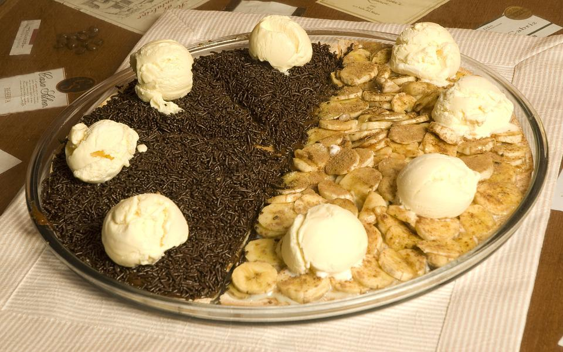

# Virtualização

Imagine, por exemplo, que temos 2 tipos de negócio os quais precisam ser atendidos por uma mesma cozinha: sorveteria e pizzaria. Como os tipos de alimentos preparados são um tanto distintos, é natural que a cozinha requerida para estes tipos seja também distinta. Criar uma cozinha que contemple ambos de forma exclusiva aumentará o tamanho da cozinha e, por consequência, a complexidade e o custo em gerenciá-la (sistema operacional ou assistente do cozinheiro, na nossa analogia). 

Considerando uma cozinha compartilhada, uma solução poderia ser empregar um assistente especial, o qual ficaria responsável por encaminhar as demandas de cada prato preparado para o assistente respectivo. Por exemplo, a palavra cobertura tem significado diferente para sorvetes e pizzas. A palavra cobertura para pizzas pode exigir inúmeros passos, enquanto que para sorvetes poderia ser apenas a localização de algo já pronto. 

A vantagem de se ter virtualmente 2 (duas) cozinhas é a economia de recursos como espaço físico e utensílios. E o fato de já se ter experiência no compartilhamento facilita, por exemplo, a inclusão de uma nova cozinha virtual, como uma saladeria.

Plataformas de compras online de restaurantes também são um exemplo de virtualização. Ao invés de termos um aplicativo para cada restaurante, podemos acessar uma plataforma que integra ofertas de diferentes restaurantes. A plataforma funciona como o assistente especial, pois deverá direcionar os pedidos para cada restaurante específico. O restaurante economiza por não ter que construir e manter um aplicativo próprio e o cliente tem a tarefa de realizar um pedido facilitada com a concentração de ofertas, possibilidade de comparação, etc.
