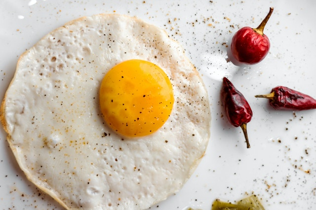

# Alô Mundo

Na programação, é comum o primeiro exemplo de uma linguagem apresentada ser o "Alô mundo!", o qual consiste na impressão desta mensagem na tela. Na nossa analogia, o exemplo básico será fritar um ovo. Neste preparo, a frigideira é uma variável, a qual receberá os ingredientes a serem processados. O ovo, o saleiro e a lata de óleo são os ingredientes, ou seja, os valores a serem manipulados pelo programa. Quando misturamos os ingredientes, iniciamos o preparo. Colocamos no fogo para que a fritura aconteça. Ao final, colocamos o ovo frito no prato para ser servido. Essas etapas podem ser visualizadas nos comentários do programa "Alô mundo!" escrito abaixo em C, uma linguagem antiga mas ainda viva, que podem estar rodando agora, por exemplo, no roteador wifi que você acessa.

~~~~~~~~
// Localização dos utensílios na cozinha para o preparo do ovo frito
#include "string.h"
#include "stdio.h"
~~~~~~~~

Uma cozinha pode ser utilizada para qualquer preparo. Como queremos fritar um ovo, devemos localizar e deixar disponível tudo que é necessário para este preparo. Neste passo de nossa receita, *#include "string.h"* disponibiliza uma frigideira adequada para se fritar um ovo, enquanto que *#include "stdio.h"* disponibiliza o prato para servirmos o nosso preparo.

~~~~~~~~
// Local onde o preparo para fritar um ovo se inicia
main () {
~~~~~~~~

Representa o *Modo de Preparo* nas receitas, ou seja, onde o preparo é iniciado.

~~~~~~~~ 
   char *msg = "Alô";
~~~~~~~~

Neste passo da receita, pegamos nossa frigideira (variável *msg*) e colocamos o óleo (texto *"Alô"*), nosso primeiro ingrediente.

~~~~~~~~
   strcat (msg, " mundo");
~~~~~~~~

Em seguida, adicionamos (função *strcat*) o ovo (texto *" mundo"*) à frigideira.

~~~~~~~~
   strcat (msg, "!");
~~~~~~~~

Agora adicionamos o sal (texto *"!"*).

~~~~~~~~
   printf (msg);
}
~~~~~~~~

Por fim, colocamos o ovo preparado (variável *msg*) no prato para ser servido. *printf* é operação que realiza a montagem do prato (impressão de uma palavra na tela). O programa acima, quando executado, exibe a seguinte mensagem clássica na tela, ou seja, o nosso ovo pronto:

~~~~~~~~
Alô mundo!
~~~~~~~~

Pode ser que alguns tenham achado muito complicado, extenso, imprimir uma singela mensagem na tela do computador. O código foi criado desta forma para tornar a analogia mais interessante. Abaixo segue um código mais sucinto que realiza a mesma tarefa:

~~~~~~~~
#include "stdio.h"

main() {
	printf ("Alô mundo!");
}
~~~~~~~~

