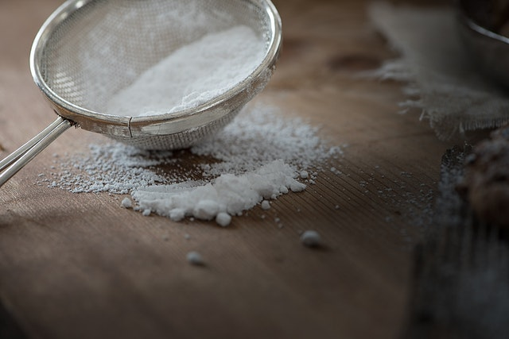

# Conversão de Tipos - Casting

Propriedade que permite que um valor de um tipo (ingrediente) seja "convertido" em outro. Por exemplo, quando um número real é atribuído a um inteiro, apenas a parte inteira é armazenada neste último. Analogamente, quando lavamos o arroz, um vasilhame contém a água e o arroz. Quando usamos uma peneira para secá-lo, o novo vasilhame conterá apenas o arroz. Há diversas outras situações onde ocorre um casting na cozinha: alimentos antes e após serem descascados, a criação de cubos de arroz após este ser preparado, os enfeites feitos com frutas, verduras e legumes para embelezar pratos e mesas, dentre outros. Observem que em todas as situações o ingrediente que está sendo manipulado é praticamente o mesmo, foi apenas modificado para atender a um fim específico.

Exemplo na cozinha:

~~~~~~~~
vasilhame <- farinha peneirada 

canecão <- suco de maracujá cuado 
~~~~~~~~

Nos exemplos acima, o ato de peneirar a farinha ou cuar um suco não modificam os alimentos por completo, mas alteram estes de maneira que fiquem mais adequados para algum uso.
