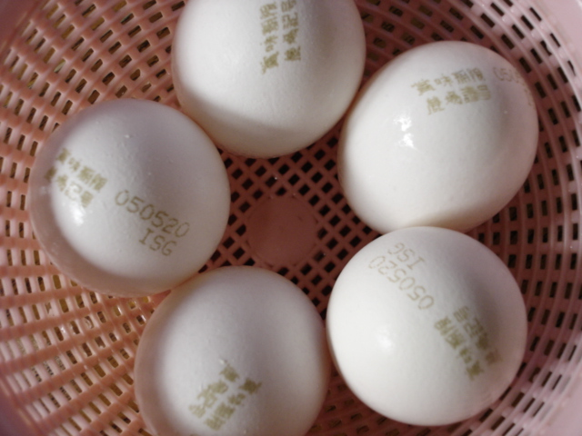

# Ordenação

[Algoritmos](./algoritmo.html) são um assunto frequente na Computação pois todo programa, em sua fase de concepção, é escrito como um algoritmo, ou seja, de forma geral, abstrata. E alguns desses algoritmos são tão comuns que acabam recebendo um nome.

**Ordenação** é um algoritmo clássico e necessário não apenas na programação ou na cozinha. Quando organizamos um guarda-roupas, por exemplo, é comum reservarmos espaços para itens similares como calças, camisas, meias e roupas íntimas. Alguns vão além e, dentro de cada item, organizam por cores. Toda essa organização ajuda na inserção de novos itens, assim como na busca por algum item desejado.

Na cozinha, uma situação onde a ordenação usualmente ocorre é na organização de dispensas. Produtos possuem prazo de validade e, para evitar desperdício, é interessante que consumamos primeiramente os produtos mais antigos, com menor tempo de validade. Apesar dessa analogia não estar associada ao preparo de um prato, suas restrições, como o tamanho de um porta ovos, torna fiel às características existentes na criação de um algoritmo de ordenação na Computação.

Uma analogia para ordenação numa receita pode ser descrita no preparo de um cozido de carne com legumes. Para este preparo, caso queiramos sentir a textura de todos os alimentos e não perdê-los dissolvidos durante o preparo, precisamos ordenar a forma com que vão para a panela. Iniciamos com os alimentos que levam mais tempo para serem cozidos e vamos adicionando os demais até chegarmos nos alimentos que cozinham muito rapidamente. Por exemplo, se queremos preparar um cozido com abóbora, batata, beterraba, cará, carne e tomate, a ordem a ser inserida na panela é: carne, beterraba, cará, batata e abóbora.
