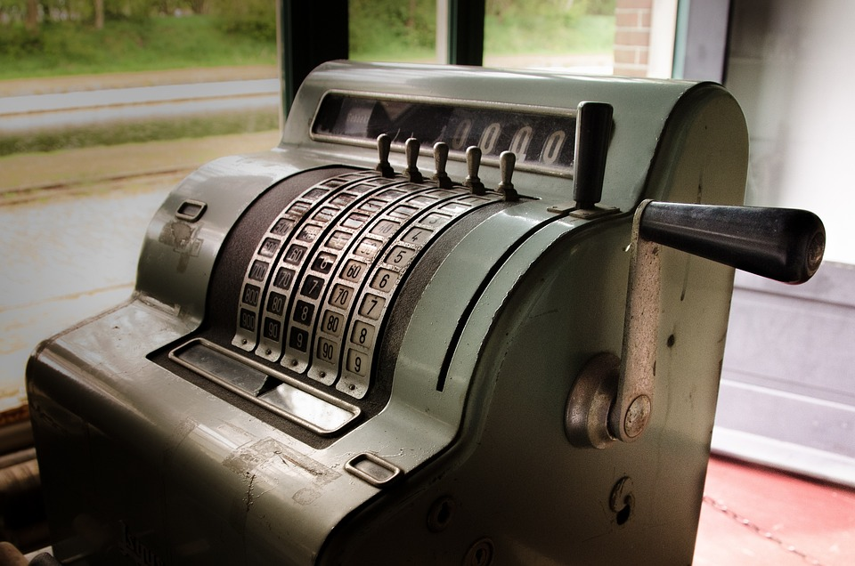

# Ponteiros

Sabemos que num restaurante as mesas são identificadas numericamente de forma a facilitar a localização por parte dos garçons. A cada número é associada uma lista de pedidos ao longo do tempo toda vez que um cliente escolhe uma mesa e inicia seus pedidos. "Filé mignon mal passado na mesa 5", diz o garçom. O valor 5 passa ser a chave para todas as informações demandas pelo cliente na mesa 5 num dado momento. Isso permite um controle preciso do que é consumido e a cobrança devida na saída do cliente. 

Observe também que é fundamental que a lista de pedidos seja apagada após a saída de um cliente. Caso contrário, novos clientes serão cobrados de forma indevida. 

Na programação, ponteiros são endereços (valores, números) de memória utilizados para referenciar áreas onde valores são armazenados. Tipicamente, estas áreas de memória são alocadas de forma dinâmica, ou seja, durante a execução do programa e numa quantidade previamente indeterminada. Essa indeterminação também vale para a quantidade de clientes que irão a um restaurante em algum dia. Esse mecanismo é útil porque permite, para programas que utilizem volumes grandes de informação de forma eventual, maior flexibilização na reserva de espaço em memória. Ou seja, o programador pode escolher o que é reservado estaticamente (alocação fixa, que perdura durante toda a execução do programa) e o que é reservado dinamicamente (alocação variável, onde não se sabe quando uma área de memória será reservada e que tamanho ela terá).

Em restaurantes também é comum que grupos desejem rearranjar mesas de forma que todos fiquem juntos. Para isso, basta que as identificações das mesas sejam temporariamente alteradas, ou seja, que as mesas 1, 2 e 3, num dado momento, sejam apenas a mesa 1. Esse rearranjo é muito natural em restaurantes, assim como na alocação de memória de computadores, pois são mecanismos manipulados de forma dinâmica. 

Outro termo em Computação que frequentemente encontramos atrelado a ponteiros é a **coleta automática de lixo**. Imagine que moremos num país corrupto onde, eventualmente, clientes saem do restaurante sem pagar. Isso acarretará vários problemas, além do prejuízo do restaurante: 1) a mesa continuará ocupada até que se descubra que o cliente não se encontra mais no restaurante; 2) novos clientes podem ter que aguardar por uma falsa lotação do restaurante. 

Uma forma moderna de resolver o problema acima seria a adoção de um sistema automático de cobrança. Toda vez que um cliente entra num restaurante, seu cartão de crédito é atrelado a um número de mesa a partir daquele momento. Na porta de saída do restaurante, o cartão do cliente é reconhecido e são lançados os valores correspondentes aos seus pedidos, além da liberação da mesa para novos clientes. Ou seja, essa cobrança acontece de forma automática. Na Computação, esse "comportamento corrupto" é um pouco mais frequente, o que torna essa cobrança automática muito importante para o funcionamento correto do sistema. 

