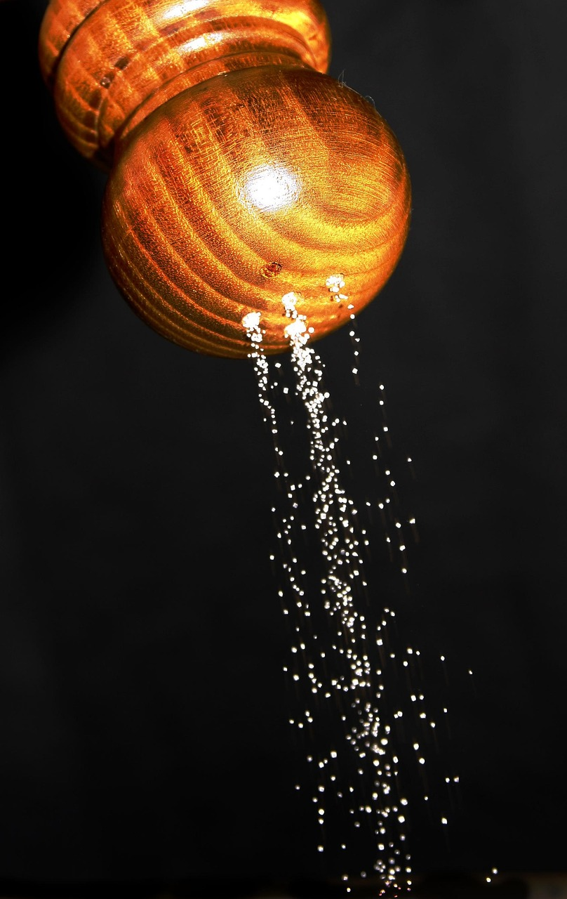

# Variáveis e Constantes

Na programação, assim como na cozinha, todos os processos envolvem a manipulação de quantidades para se produzir algo. Para armazenar essas quantidades, utilizamos utensílios, como descrito no conceito de [Identificadores](https://carlosbazilio.github.io/livros/programandonacozinha/conceitos-basicos/identificadores.html). Esses utensílios, na programação, são chamados de variáveis, pois o conteúdo que estes armazenam pode variar, ou seja, podem armazenar tipos de produtos totalmente diferentes. Uma bacia usada para reservar uma massa num momento, pode ser utilizada para armazenar frutas a serem cortadas noutro momento.

O contrário de variáveis são constantes, os quais são utensílios utilizados para armazenar produtos que não variam. Por exemplo, pense num saleiro ou num açucareiro. Na verdade, com o uso do saleiro ou do açucareiro, a quantidade desses itens vai diminuindo com o tempo. Mas a ideia da analogia pensada aqui se refere ao tipo do material armazenado. Não é natural que utilizemos um saleiro para armazenar alguma coisa que não seja sal, correto !?

